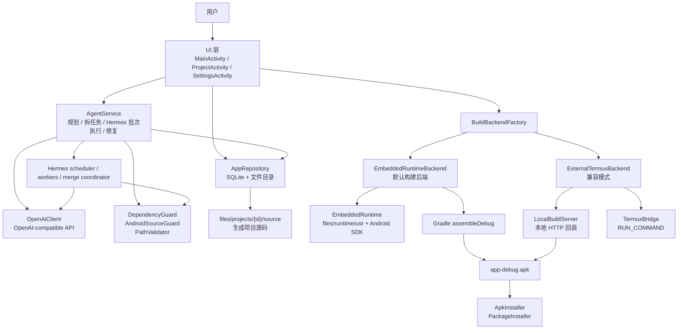

# 01 · 架构

## 总体架构



## 分层说明

### UI 层

主要入口：

- `MainActivity`：项目列表、新建项目、搜索、重命名、删除、设置入口。
- `ProjectActivity`：项目工作台。统一时间线显示消息/任务/构建日志，文件侧滑栏显示源码，底部输入和操作按钮触发计划、执行、构建、安装。
- `SettingsActivity`：模型配置、语言、构建后端、依赖模式、runtime 安装、离线 Maven、Termux 辅助配置。
- `SourceFilesActivity`：独立源码浏览页，当前项目页也内置了侧滑源码浏览。
- `ThirdPartyNoticesActivity`：第三方声明。

UI 状态策略（均为 final + 私有构造 + 静态方法的单职责类，便于单元测试）：

- `ProjectTimelinePolicy`：时间线条目顺序；构建日志行锚定与消息可见性解耦，隐藏消息后日志行不丢失。
- `ProjectTimelineMessageVisibilityPolicy`：识别冗余 assistant 状态消息（构建开始/成功、执行下一步、已完成 X、全部完成、拆分任务等，含中英文），在时间线中隐藏；用户消息、计划全文、修复总结、所有错误消息保留。
- `ProjectBuildActionPolicy`：决定主操作是 Build 还是 Repair，及两个按钮的可用性。
- `ProjectRepairFlowPolicy`：选取手动修复的目标失败 job（最新失败 job，或 `repair_failed` 后回退到最近一条带日志的失败 job）。
- `ProjectBuildLogTitlePolicy`：构建日志行标题（运行/成功/失败/修复记录）。
- `ProjectBuildLogVisibilityPolicy`：某条消息是否需要在其后挂一条构建日志行。
- `ProjectBuildLogExpansionPolicy`：失败构建日志默认折叠、是否显示展开按钮。
- `ProjectOperationStatus`：决定操作状态行是否显示及文案。
- `ProjectLiveState`：判断实时任务状态是否变化。
- `TaskRunningDisplayPolicy`：任务执行中的预测展示。
- `ProjectTaskListDisplayPolicy`：任务列表默认折叠，只展示运行中、失败、等待合并和第一个待执行任务；展开后按 Hermes 任务契约分组。
- `HermesAgentRunDisplayPolicy`：把 `hermes_agent_runs` 转成批次、Agent 编号、锁定路径和状态文案。
- `WorkAwakePolicy`：工作中是否保持屏幕/进程活跃。

### Agent 层

核心是 `AgentService`。它负责把 UI 操作串成后台工作：

- `planAsync()`：生成工程计划。
- `executePlanAsync()`：拆分任务，使用 `HermesParallelScheduler` 选出安全批次，逻辑子 Agent 在独立 scratch source 中并行生成文件操作，再由 `HermesMergeCoordinator` 写回 canonical source。
- `repairBuildAsync()`：根据构建日志修复当前源码；`HermesRepairShardingPolicy` 只对低耦合资源缺失/独立 Java 符号缺失尝试并行修复，Gradle、Manifest、构造签名等共享风险保持单 Agent。
- `sourceSnapshot()`：把当前源码裁剪成模型上下文。
- `createAndApplyTaskOperations()`：模型返回文件操作后，经过策略校验并写入源码。

`OpenAiClient` 封装模型请求和 prompt：

- `createEngineeringPlan()`：生成工程计划。
- `createImplementationTasks()`：把计划拆成任务。
- `createTaskOperations()`：执行单个任务，返回 write/delete 操作。
- `createSpecJson()`：旧的快速生成 AppSpec 路径。
- prompt 片段还包含 `VersionUpgradePolicy.prompt()`：当需求/计划/任务涉及版本号、发布、构建号时，要求模型同步更新 `app/build.gradle` 的 `versionCode`/`versionName`。

Hermes 并行执行的边界：

- 并行子 Agent 是 App 内的逻辑 worker，不是外部进程；并发上限来自设置页，当前可选串行、2 个、3 个。
- 只有文件锁互不冲突、任务契约风险较低、且不要求立即构建的任务会进入同一批次。
- 每个 worker 只写自己的 scratch source；canonical source 只允许 merge coordinator 写入。
- merge 前会复跑任务契约守护和确定性预检；路径冲突、unsafe path、wildcard touched path 会阻断合并。
- API 429/rate limit 会转成用户可读提示，建议降到串行或 2 个子 Agent 后重试。

失败分类与日志上下文：

- `BuildFailureClassifier`：把构建/生成失败归类为 `KOTLIN_COMPILE`、`JAVA_COMPILE`、`RESOURCE_LINKING`、`DEPENDENCY_POLICY`、`DEPENDENCY_NETWORK`、`DEPENDENCY_CONFLICT`、`BUILD_TIMEOUT`、`RUNTIME_ENVIRONMENT`、`UNKNOWN`，并给出 `repairableByModel`（环境/网络/权限/超时类为 false，不提供修复按钮）。
- `BuildLogContextExtractor`：从构建日志提取 javac 诊断、缺失字段提示等，裁剪为模型可用的失败上下文。
- `TaskOperationErrorPolicy`：判定一次任务文件操作抛出的 `IllegalArgumentException`（如 `Dependency policy blocked...`、`Generated source policy blocked...`）是否属于可改写错误，决定是否触发更严格的改写重试。

策略防线：

- `DependencyGuard`：按依赖模式拦截 Maven 依赖、Kotlin、Compose、DataBinding/ViewBinding。
- `AndroidSourceGuard`：检查资源引用、XML id、禁止 Kotlin/lambda/synthetic/viewBinding 等。
- `PathValidator`：路径安全辅助。
- `PolicyRewriteInstruction`：当模型输出被策略拦截时，生成下一轮更严格的改写指令。

### 数据层

`AppRepository` 是统一仓储，背后使用 `DatabaseHelper` 和 App 私有文件目录。

SQLite 数据库：`android_builder.db`，当前 `DB_VERSION = 6`。

| 表 | 内容 |
| --- | --- |
| `projects` | 项目名、包名、描述、最近构建状态 |
| `messages` | user/assistant 对话和可选关联 build job |
| `project_plans` | 当前工程计划、状态、关联 build job |
| `project_tasks` | 计划拆分后的执行任务、状态、结果摘要、开始/完成时间 |
| `build_jobs` | 构建/生成/修复任务状态、阶段、日志、APK、错误摘要、重试次数 |
| `artifacts` | 构建产物，目前主要是 APK |
| `ai_conversations` | 云端/Hermes/确定性审查请求与响应日志 |
| `hermes_execution_runs` | 一次 Hermes 执行或修复运行的模式、并发上限、源树 hash、状态 |
| `hermes_agent_runs` | 计划任务子 Agent 的批次、锁定路径、scratch 目录、合并状态 |

文件路径：

```text
files/projects/{projectId}/source         # 生成项目源码
files/projects/{projectId}/jobs/{jobId}/  # project.zip、build.log、app-debug.apk
files/runtime/                            # 嵌入式构建环境
files/runtime/work/{projectId}/{jobId}/   # 每次构建工作目录
files/offline-maven/                      # 导入的离线 Maven 缓存
```

### 构建层

构建后端接口是 `BuildBackend`，由 `BuildBackendFactory` 根据设置创建：

- `EmbeddedRuntimeBackend`：默认路径，在 App 私有 runtime 中运行 Gradle。
- `ExternalTermuxBackend`：兼容模式，通过 Termux RUN_COMMAND 启动脚本构建。

`EmbeddedRuntimeBackend` 的职责：

- 初始化 `EmbeddedRuntime`。
- 复制项目源码到 `files/runtime/work/{projectId}/{jobId}/source`。
- 调用 `AndroidGradleNormalizer` 修正 Gradle、Manifest、namespace、JDK、AAPT2、镜像仓库等。
- 检查在线依赖模式下 Maven 可达性。
- 运行 `gradle --no-daemon --console=plain assembleDebug --stacktrace`。
- 通过 `BuildTimeoutPolicy` 监控总超时和无输出超时。
- 收集日志头部、尾部、失败上下文，用于错误摘要和手动修复。

`AndroidGradleNormalizer` 做的关键事：

- 确保根 `build.gradle` 有版本化 `com.android.application` 插件。
- 添加阿里云 Maven 镜像和官方仓库。
- 对 Kotlin stdlib 做版本对齐，降低 duplicate class 风险。
- 写入稳定的 `gradle.properties`：关闭 daemon、限制 worker、设置 HTTP timeout、指定 AAPT2。
- 强制 Java 8 source/target。
- 移除 Manifest 的 `package="..."`，补 `namespace`。

### Runtime 层

`embedded-runtime` 模块维护手机私有目录下的构建环境：

```text
files/runtime/
├── home/
├── usr/
│   ├── bin/
│   └── android-sdk/
└── work/{projectId}/{jobId}/
```

最低工具要求：

```text
usr/bin/gradle
usr/bin/java
usr/bin/aapt2
usr/android-sdk/platforms/android-XX/android.jar
```

`RuntimeInstaller` 支持从两处安装 bootstrap：

- APK assets：`runtime/bootstrap-aarch64.zip` 或 `runtime/bootstrap-arm64.zip`。
- 设置页配置的 URL。

完整 runtime zip 往往超过 400 MB，普通 GitHub 仓库不能直接推送超过 100 MB 的单文件。

### Termux 兼容层

Termux 模式用于兼容，不是默认推荐路径。

- `TermuxBridge` 调用 `com.termux.app.RunCommandService`。
- `LocalBuildServer` 提供带 token 的本地 HTTP 服务。
- Termux 脚本下载 `project.zip`、执行构建、回传日志/APK/结果。

Termux 需要：

- 安装 Termux。
- 启用 `allow-external-apps=true`。
- Android Builder 获得 `com.termux.permission.RUN_COMMAND`。
- Termux 获得悬浮窗权限。

## 依赖模式架构

`BuildBackendSettings.dependencyMode()` 有三种：

- `offline_safe`：默认。禁止新增 Maven 依赖和高风险框架，只允许 Android SDK + Java + XML + SQLiteOpenHelper。
- `local_cache`：只允许使用导入到 `files/offline-maven` 的依赖。
- `online`：允许 `OnlineDependencyPolicy` 白名单中的在线依赖，但仍禁用 DataBinding/ViewBinding/Compose 等。

依赖模式影响三处：

- prompt：`OpenAiClient.dependencyPolicyPrompt()`。
- 写入前校验：`DependencyGuard`。
- 构建准备：`EmbeddedRuntimeBackend.dependencyInitScript()` 和在线 Maven 可达性检查。

## 关键扩展点

| 目标 | 修改位置 |
| --- | --- |
| 调整模型 prompt | `OpenAiClient` |
| 增减允许依赖 | `DependencyGuard`、`OnlineDependencyPolicy` |
| 改生成源码防线 | `AndroidSourceGuard`、`PolicyRewriteInstruction` |
| 改任务执行方式 | `AgentService` |
| 改项目页 UI | `ProjectActivity`、`activity_project.xml`、`row_*` |
| 改时间线条目顺序/降噪 | `ProjectTimelinePolicy`、`ProjectTimelineMessageVisibilityPolicy` |
| 改构建日志展示 | `ProjectActivity.TimelineAdapter`、`row_build_log.xml`、`ProjectBuildLog*Policy` |
| 改 Build/Repair 按钮与修复目标 | `ProjectBuildActionPolicy`、`ProjectRepairFlowPolicy`、`BuildFailureClassifier` |
| 改安装结果判定 | `InstallStatusPolicy`、`InstallStatusReceiver`、`ApkInstaller` |
| 改嵌入式构建 | `EmbeddedRuntimeBackend`、`EmbeddedRuntime`、`AndroidGradleNormalizer` |
| 改 Termux 模式 | `ExternalTermuxBackend`、`TermuxBridge`、`LocalBuildServer`、assets 下脚本 |
| 改数据库 | `DatabaseHelper`、`AppRepository`、`model/*Record` |
| 改设置项 | `SettingsActivity`、`BuildBackendSettings`、`AppSettings`、`OpenAiClient` prefs |

## 构建成功率保护

项目已有这些保护机制：

- Maven 仓库使用阿里云镜像 + 官方源。
- 关闭 Gradle daemon，限制 worker 为 1。
- Gradle HTTP connection/socket timeout 设为 30 秒。
- `BuildTimeoutPolicy` 监控总超时和无输出超时。
- Android SDK metadata、licenses、build-tools wrapper 会在 runtime 初始化时补齐。
- 生成项目强制 Java 8 source/target。
- 构建日志摘要保留头部、尾部、失败上下文（`BuildLogContextExtractor`）。
- 修复为手动触发：`BuildFailureClassifier` 判定环境/网络/权限/超时类失败 `repairableByModel=false`，不提供 Repair 按钮；仅源码/资源/编译类失败提供修复，且每次修复都由用户点击触发，无自动重试上限。
