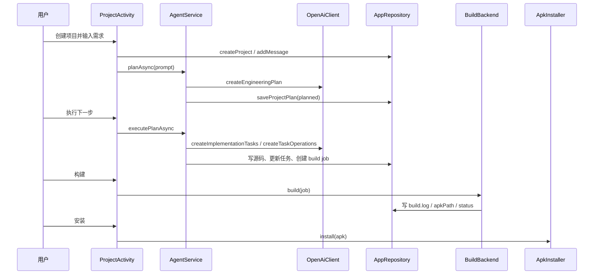

# 02 · 业务流程

## 总流程



## 1. 创建项目

入口：`MainActivity.showNewProjectDialog()`。

流程：

1. 用户输入初始需求，可选输入项目名和包名。
2. 如果没有项目名，用 `NameUtils.projectNameFromPrompt()` 从需求推断。
3. 如果没有包名，用 `NameUtils.packageNameFromProject()` 生成。
4. `AppRepository.createProject()` 写入 `projects` 表。
5. 打开 `ProjectActivity`，通过 `EXTRA_INITIAL_PROMPT` 传入初始需求。
6. 如果项目还没有消息，`ProjectActivity` 自动调用 `generatePlan()`。

关键数据：

- `projects.name`
- `projects.package_name`
- `projects.description`
- `projects.last_build_status`

## 2. 生成工程计划

入口：`ProjectActivity.generatePlan()`。

流程：

1. 校验输入框非空。
2. 用 `OpenAiClient.isConfigured()` 检查 API key。
3. `AgentService.planAsync()` 启动后台线程。
4. `ActiveWorkRegistry.begin()` 启动前台工作保活。
5. `AppRepository.addMessage(projectId, "user", prompt, null)` 保存用户需求。
6. `AppRepository.saveProjectPlan(projectId, "", "planning", null)` 标记规划中。
7. `OpenAiClient.createEngineeringPlan()` 调用模型生成计划。
8. 计划统一补 `# 工程计划` 或 `# Engineering Plan` 标题。
9. `saveProjectPlan(..., "planned", null)` 保存计划。
10. 清空旧任务：`clearProjectTasks()`。
11. 计划作为 assistant 消息写入 `messages`。
12. `CapabilityAnalyzer` 对计划做能力风险提示。

计划状态：

| 状态 | 含义 |
| --- | --- |
| `idle` | 没有可执行计划 |
| `planning` | 正在生成计划 |
| `planned` | 计划已生成，等待执行 |
| `coding` | 正在执行计划任务 |
| `generated` | 所有任务完成，源码可构建 |

## 3. 拆分并执行计划任务

入口：`ProjectActivity.executePlan()` -> `AgentService.executePlanAsync()`。

流程：

1. 检查最新计划存在且状态为 `planned`。
2. `AgentService.executePlan()` 创建新的 `build_jobs` 记录。
3. 项目计划状态改为 `coding`。
4. 如果还没有 `project_tasks`，调用 `OpenAiClient.createImplementationTasks()` 把计划拆成 5-12 个任务。
5. `ImplementationTaskParser` 解析任务 JSON。
6. `AppRepository.replaceProjectTasks()` 写入任务，状态默认 `pending`。
7. 选择下一条 `failed` 或 `pending` 任务：`nextPendingProjectTask()`。
8. 任务标记为 `running`。
9. `sourceSnapshot()` 读取当前源码，裁剪后放进 prompt。
10. `OpenAiClient.createTaskOperations()` 让模型返回文件操作 JSON。
11. `TaskOperationsParser` 解析 JSON。
12. `FileOperationsWriter.apply()` 应用文件操作。
13. 任务成功后标记 `done`，写入 `result_summary`。
14. 如果还有任务，计划状态回到 `planned`；如果没有任务，状态为 `generated`。
15. 打包当前源码为 `project.zip`，写入 `build.log`。
16. `build_jobs` 状态更新为 `generated/ready_for_build`。

任务状态：

| 状态 | 含义 |
| --- | --- |
| `pending` | 待执行 |
| `running` | 正在执行 |
| `done` | 已完成 |
| `failed` | 执行失败，可重试 |

## 4. 文件操作应用和策略重写

入口：`AgentService.createAndApplyTaskOperations()`。

流程：

1. 使用当前任务 instruction 调模型。
2. 解析模型返回的 `TaskOperations`。
3. `FileOperationsWriter.apply()` 在临时目录执行 write/delete。
4. `DependencyGuard` 检查依赖和源码 import。
5. 检查必须存在的工程文件：
   - `settings.gradle`
   - `build.gradle`
   - `app/build.gradle`
   - `app/src/main/AndroidManifest.xml`
6. `AndroidSourceGuard` 检查 Java/XML/资源引用。
7. 校验通过后，用临时目录替换真实源码目录。
8. 若抛出 `IllegalArgumentException` 且 `TaskOperationErrorPolicy.shouldRequestRewrite()` 判定可改写，`PolicyRewriteInstruction.create()` 生成更严格 instruction 重试，最多 `POLICY_REWRITE_ATTEMPTS`（3）次。

> 任务 prompt 还会拼入 `VersionUpgradePolicy.prompt()`：当需求/计划/任务涉及版本号、发布、构建号时，要求模型在同一次改动里更新 `app/build.gradle` 的 `versionCode`/`versionName`。

可改写策略错误通常包括：

- `Dependency policy blocked...`
- `Generated source policy blocked...`

不可改写或超过次数后，任务标记失败。

## 5. 构建 APK

入口：`ProjectActivity.buildLatest()`。

通用流程：

1. `hasSourceFiles()` 检查源码目录非空（不再强制要求计划处于 `generated` 状态）。
2. 检查 `buildServer` 已就绪。
3. `AppRepository.createBuildJob()` 新建一条 build job（每次 Build 都新建，不复用旧 job）。
4. 根据设置创建后端：`BuildBackendFactory.create()`。
5. 重置该 job 的 `build.log`，`build_jobs` 状态改为 `building`，并写入“构建已启动”消息。
6. 调用 `backend.build()`，完成回调里 `refresh()` 刷新时间线。

> 安装按钮基于 `latestBuildJobWithApk()` 而非这条在建 job，因此新建的在建 job 不会让上一次成功 APK 的 Install 按钮失效。

### 5.1 嵌入式 runtime 构建

入口：`EmbeddedRuntimeBackend.runBuild()`。

流程：

1. 初始化 runtime 目录和 Android SDK metadata。
2. 将 `files/projects/{projectId}/source` 复制到 `files/runtime/work/{projectId}/{jobId}/source`。
3. 检查最低工具链：`gradle`、`java`、`aapt2`、`android.jar`。
4. 写入 `local.properties` 指向 runtime Android SDK。
5. `AndroidGradleNormalizer` 修正 settings/root build/app build/manifest/gradle.properties。
6. local cache 模式下生成 `androidbuilder-offline-maven.gradle` init script。
7. online 模式下检查 Google Maven 和 Maven Central 可达性。
8. 先运行 `gradle --version` 做 smoke test。
9. 再运行 `assembleDebug --stacktrace`。
10. 构建成功后查找 APK，复制到 job 目录。
11. 写入 `artifacts`，更新 `build_jobs` 为 `success`。
12. 构建失败则保存错误摘要，状态为 `failed`。

构建命令特征：

```text
gradle --no-daemon --console=plain assembleDebug --stacktrace
```

关键环境变量：

- `HOME`
- `PREFIX`
- `ANDROID_HOME`
- `ANDROID_SDK_ROOT`
- `ANDROID_USER_HOME`
- `JAVA_HOME`
- `GRADLE_USER_HOME`
- `TMPDIR`
- `JAVA_TOOL_OPTIONS`
- `LD_LIBRARY_PATH`
- `PATH`

### 5.2 外部 Termux 构建

入口：`ExternalTermuxBackend.build()`。

流程：

1. `build_jobs` 改为 `building/external_termux_start`。
2. `TermuxBridge.build()` 调用 Termux `RunCommandService`。
3. 传入 `projectId`、`jobId`、`callbackUrl`、`token`。
4. Termux 脚本从 `LocalBuildServer` 下载 `project.zip`。
5. Termux 构建过程中 POST 日志到 `/projects/{id}/jobs/{jobId}/logs`。
6. 构建完成后 POST APK 到 `/artifact`。
7. 最后 POST 结果到 `/result`。
8. `LocalBuildServer` 更新 `build_jobs`、`artifacts` 和 assistant 消息。

## 6. 构建失败手动修复

入口：`ProjectActivity.repairLatest()`（由项目页 Repair 按钮触发，纯手动，无自动重试）。

是否提供 Repair 按钮由 `ProjectBuildActionPolicy.canRepair()` 决定，前置条件：

- 当前不忙（`!busy`）。
- 存在 `status == failed` 且带 `logsPath` 的目标 job（由 `ProjectRepairFlowPolicy.repairTargetJob()` 选取：最新失败 job，或 `repair_failed` 阶段后回退到最近一条带日志的失败 job）。
- `BuildFailureClassifier.classify(...).repairableByModel == true`，即失败属于可由模型修复的源码/资源/编译类，而非环境/网络/权限/超时类。

流程：

1. 取目标失败 job，读取其 `build.log`。
2. `BuildLogContextExtractor` 裁剪失败上下文（javac 诊断、缺失字段提示等）。
3. `AgentService.repairBuildAsync()` 让模型根据日志修复源码。
4. 修复本质上仍走 `createAndApplyTaskOperations()`。
5. 修复成功后产出新的 generated job，时间线刷新；**不自动重新构建**，由用户再次点击 Build。
6. 修复失败则 job 进入 `repair_failed`，用户可再次手动修复或改 Build。
7. `build_jobs.retry_count` 记录已尝试次数，但不再作为自动修复上限。

> 历史说明：旧版本曾有 `BuildRepairPolicy` + `ProjectActivity.maybeAutoRepair()` 的“最多自动修复 3 次”逻辑，现已移除，全部改为手动点击。

常见可修复方向：

- 资源引用缺失。
- Java 编译错误。
- Manifest/namespace 问题。
- Gradle 配置可归一化的问题。

常见不提供修复（`repairableByModel=false`）方向：

- runtime 工具链缺失。
- 网络依赖不可达。
- Termux 权限问题。
- 设备环境限制。

## 7. 安装 APK

入口：`ProjectActivity.installLatest()`。

流程：

1. `AppRepository.latestBuildJobWithApk()` 取最近一条 `apk_path` 非空的 build job（不是单纯的最新 job，避免新建的在建 job 让 Install 失效）。
2. 检查 `apkPath` 是否存在，缺失则提示先生成/构建。
3. `ApkInstaller.install(new File(job.apkPath))`，通过 Android `PackageInstaller` 提交会话，普通设备需用户确认安装。
4. `InstallStatusReceiver` 接收 PackageInstaller 回调，交给 `InstallStatusPolicy.resultFor(status)` 判定：
   - `STATUS_PENDING_USER_ACTION` → 弹出系统确认页。
   - `STATUS_SUCCESS` → 安装成功。
   - 其它一律视为失败（不再因设备上已存在旧版本同包名就误报成功）。

相关权限：

```xml
<uses-permission android:name="android.permission.REQUEST_INSTALL_PACKAGES" />
```

## 8. 设置和 runtime 安装流程

入口：`SettingsActivity`。

设置项：

- 模型 provider：OpenAI、DeepSeek、MiniMax、Custom。
- API key、endpoint、model。
- 语言。
- 构建后端：embedded、external_termux。
- 依赖模式：offline_safe、local_cache、online。
- runtime bootstrap URL。
- offline-maven.zip。

Bundled runtime 安装：

1. 点击安装 bundled runtime。
2. `RuntimeInstaller.installBundledAsync()` 查找 assets：
   - `runtime/bootstrap-aarch64.zip`
   - `runtime/bootstrap-arm64.zip`
3. `EmbeddedRuntime.installBootstrap()` 解压到 `files/runtime`。
4. 补 Android SDK metadata、licenses、Gradle launcher wrapper。

URL runtime 安装：

1. 填写 bootstrap zip URL。
2. `RuntimeInstaller.installFromUrlAsync()` 下载。
3. 同样调用 `installBootstrap()` 解压。

离线 Maven：

1. 设置页选择 `offline-maven.zip`。
2. 解压到 `files/offline-maven`。
3. local cache 模式下，构建生成 init script 指向该目录。

## 9. 项目页时间线展示流程

入口：`ProjectActivity.refresh()` 和 `TimelineAdapter`。

数据来源：

- `messages`
- `project_tasks`
- `latestProjectPlan`
- `latestBuildJob`
- `operationStatus`
- 消息可见性掩码 `messageVisible()`（基于 `ProjectTimelineMessageVisibilityPolicy`）
- 构建日志锚点 `messageBuildJobIds()`（基于 `ProjectBuildLogVisibilityPolicy`）

顺序由 `ProjectTimelinePolicy.entries()` 决定：

1. 任务行（无任务但有计划时显示一条空任务提示）。
2. 消息行，按时间顺序；被 `ProjectTimelineMessageVisibilityPolicy.isChatter()` 判定为冗余的 assistant 状态消息**不产出消息行**。
3. 构建日志行，挂在某 job 最后一条关联消息之后。**关键**：日志行锚点只依赖 `linkedBuildJobId`，与消息是否被隐藏无关——即使“构建完成”那条消息被降噪隐藏，日志行仍会出现在原位置，不会丢失。
4. 操作状态行，放在列表末尾（仅在忙碌/执行计划/有在跑的 job 时显示）。

降噪与展示要点：

- 一次构建过去会产生“构建开始消息 + 构建完成消息 + 日志行”三行，现收敛为一张构建日志卡。
- 构建用时从被隐藏的消息迁移到构建日志卡标题（如“构建成功 · 用时 12s”）。
- 失败构建日志默认折叠，由 `ProjectBuildLogExpansionPolicy` 控制是否展开。
- 各类行（消息/任务/构建日志/操作状态）统一使用 `@style/Widget.AndroidBuilder.Card` 卡片样式。
- 降噪只发生在显示层，消息仍完整保存在 `messages` 表中。

长按行为：

- 消息：复制或删除。
- 操作状态：复制状态。
- 任务：复制任务日志摘要。
- 构建日志：复制构建日志预览。

## 10. 工作保活和中断恢复

后台工作入口会调用 `ActiveWorkRegistry.begin()`：

- 规划：`foreground_work_planning`
- 编码：`foreground_work_coding`
- 修复：`foreground_work_repairing`
- 构建：`foreground_work_building`

`ProjectActivity.recoverInterruptedWorkIfNeeded()` 在打开项目时恢复异常中断状态：

- `planning` 回到 `idle`。
- `coding` 回到 `planned`。
- `running` 任务标记为 `failed`。
- `queued/generating/building` 的 job 标记为 `failed/interrupted`。

## 11. 状态速查

### build_jobs.status

| 状态 | 含义 |
| --- | --- |
| `queued` | 已创建但未开始 |
| `generating` | 模型生成或修复中 |
| `generated` | 源码已生成，等待构建 |
| `building` | 正在构建 |
| `built` | Termux 模式已收到 APK，但最终结果可能还未回调 |
| `success` | 构建成功 |
| `failed` | 构建/生成/修复失败 |

### 常见 build_jobs.phase

| phase | 含义 |
| --- | --- |
| `waiting` | 初始等待 |
| `cloud_spec` | 模型生成中 |
| `ready_for_build` | 源码已准备好 |
| `embedded_runtime` | 嵌入式 runtime 构建中 |
| `embedded_runtime_finished` | 嵌入式构建结束 |
| `embedded_runtime_missing_tools` | runtime 工具链不完整 |
| `embedded_runtime_timeout` | 构建超时 |
| `external_termux_start` | Termux 构建已启动 |
| `termux` | Termux 回传日志中 |
| `artifact_received` | Termux 回传 APK |
| `finished` | Termux 回传最终结果 |
| `repairing_build_failure` | 模型修复构建失败 |
| `repair_failed` | 修复失败 |
| `interrupted` | App 被关闭或工作被中断 |
